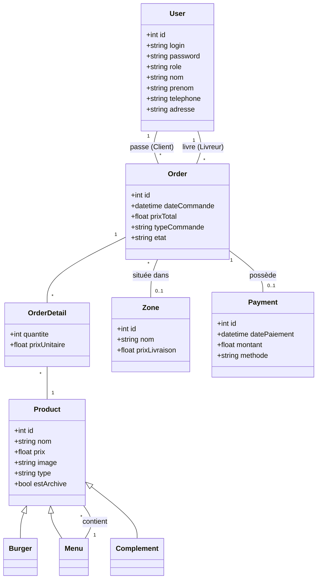
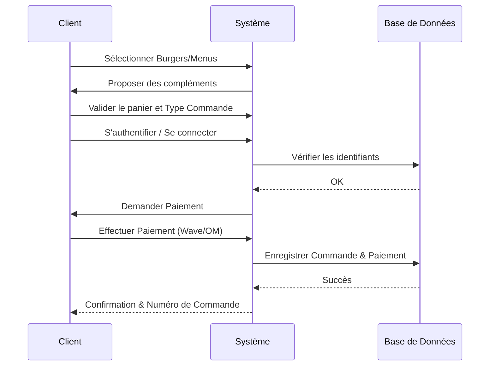

# Documentation de Modélisation - Brasil Burger

Ce document contient la modélisation UML et le Modèle Logique de Données (MLD) pour le projet Brasil Burger.

## 1. Diagramme de Cas d'Utilisation (Use Case)

```mermaid
useCaseDiagram
    actor "Client" as C
    actor "Gestionnaire" as G
    actor "Livreur" as L

    package "Application Brasil Burger" {
        usecase "S'authentifier" as UC1
        usecase "Créer un compte" as UC2
        usecase "Voir le catalogue (Burgers, Menus)" as UC3
        usecase "Commander un Burger/Menu" as UC4
        usecase "Suivre ses commandes" as UC5
        usecase "Payer une commande (Wave/OM)" as UC6
        usecase "Filtrer le catalogue" as UC7
        
        usecase "Gérer les produits (CRUD Burgers, Menus, Compléments)" as UC8
        usecase "Lister/Annuler les commandes" as UC9
        usecase "Changer l'état d'une commande (Terminer)" as UC10
        usecase "Affecter une commande à un livreur (par zone)" as UC11
        usecase "Consulter les statistiques" as UC12
    }

    C --> UC1
    C --> UC2
    C --> UC3
    C --> UC4
    C --> UC5
    C --> UC6
    C --> UC7

    G --> UC1
    G --> UC8
    G --> UC9
    G --> UC10
    G --> UC11
    G --> UC12
    
    L --> UC1
    L --> UC5
```

## 2. Diagramme de Classe



## 3. Diagramme de Séquence (Conception - Passer une commande)



## 4. Modèle Logique de Données (MLD)

- **users** (**id**, login, password, role, nom, prenom, telephone, adresse)
- **products** (**id**, nom, prix, image, type, est_archive)
- **menu_items** (**#menu_id**, **#product_id**, quantite)
- **zones** (**id**, nom, prix_livraison)
- **orders** (**id**, **#client_id**, **#livreur_id**, **#zone_id**, date_commande, prix_total, type_commande, etat)
- **order_details** (**#order_id**, **#product_id**, quantite, prix_unitaire)
- **payments** (**id**, **#order_id**, date_paiement, montant, methode)
