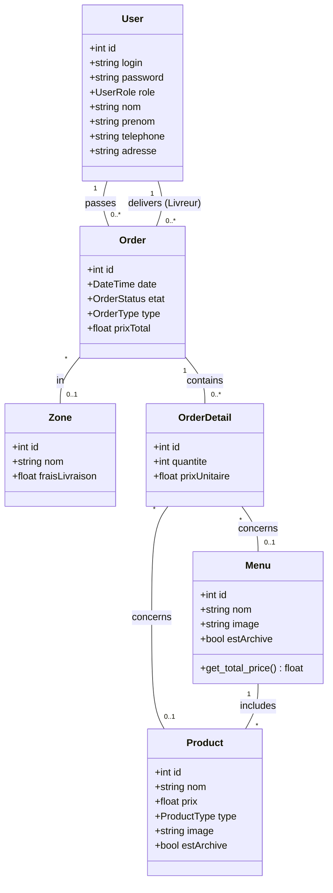

# Class Diagram - Brasil Burger

```mermaid
classDiagram
    class User {
        +int id
        +string login
        +string password
        +UserRole role
        +string nom
        +string prenom
        +string telephone
        +string adresse
    }

    class Zone {
        +int id
        +string nom
        +float fraisLivraison
    }

    class Product {
        +int id
        +string nom
        +float prix
        +ProductType type
        +string image
        +bool estArchive
    }

    class Menu {
        +int id
        +string nom
        +string image
        +bool estArchive
        +get_total_price() float
    }

    class Order {
        +int id
        +DateTime date
        +OrderStatus etat
        +OrderType type
        +float prixTotal
    }

    class OrderDetail {
        +int id
        +int quantite
        +float prixUnitaire
    }

    User "1" -- "0..*" Order : passes
    User "1" -- "0..*" Order : delivers (Livreur)
    Order "1" -- "0..*" OrderDetail : contains
    OrderDetail "*" -- "0..1" Product : concerns
    OrderDetail "*" -- "0..1" Menu : concerns
    Menu "1" -- "*" Product : includes
    Order "*" -- "0..1" Zone : in
```
