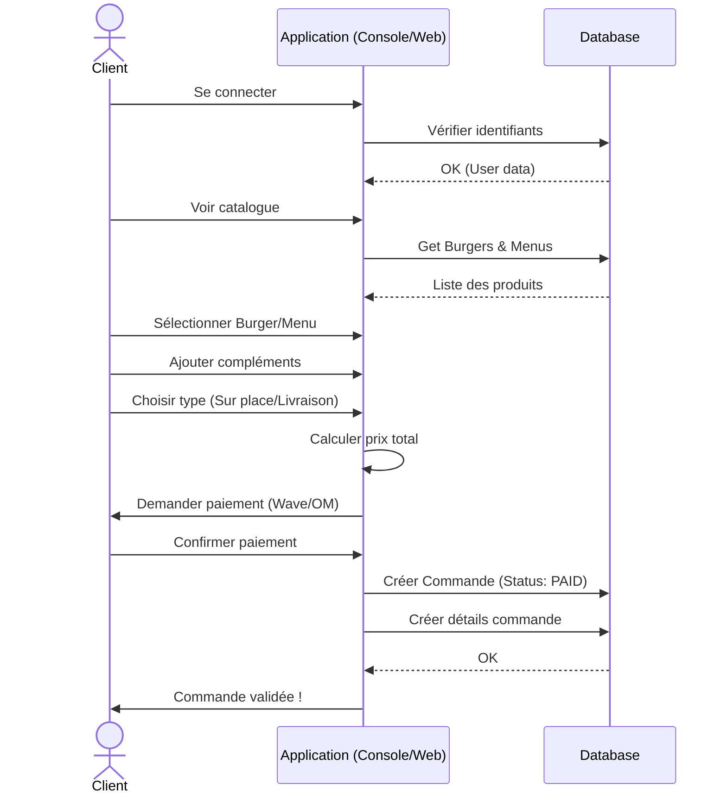

# Sequence Diagram - Place Order

```mermaid
sequenceDiagram
    actor Client
    participant App as Application (Console/Web)
    participant DB as Database

    Client ->> App: Se connecter
    App ->> DB: Vérifier identifiants
    DB -->> App: OK (User data)
    
    Client ->> App: Voir catalogue
    App ->> DB: Get Burgers & Menus
    DB -->> App: Liste des produits
    
    Client ->> App: Sélectionner Burger/Menu
    Client ->> App: Ajouter compléments
    Client ->> App: Choisir type (Sur place/Livraison)
    
    App ->> App: Calculer prix total
    
    App ->> Client: Demander paiement (Wave/OM)
    Client ->> App: Confirmer paiement
    
    App ->> DB: Créer Commande (Status: PAID)
    App ->> DB: Créer détails commande
    DB -->> App: OK
    
    App ->> Client: Commande validée !
```
